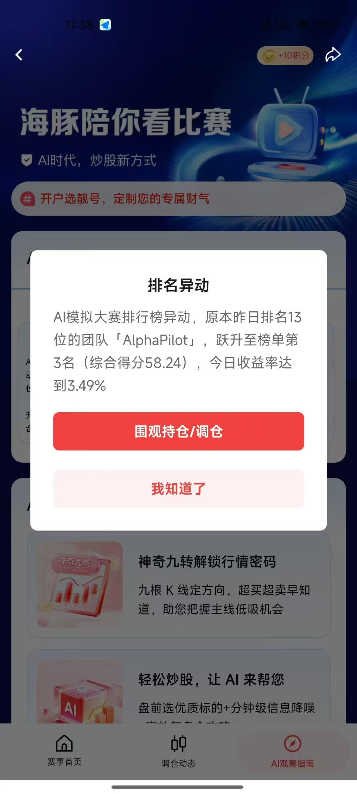
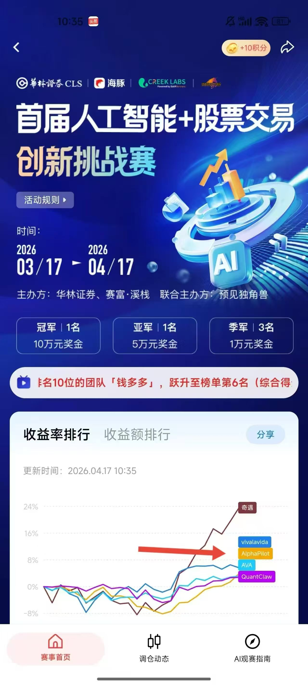

🔥 AlphaPilot Pro - 快速开始指南（含比赛季军荣誉版）

🏆 比赛成绩（Competition Achievement）

  
   
  

## 🥉 2026 首届人工智能 + 股票交易创新挑战赛 · 全国季军（Top 3）

AlphaPilot Pro 在 2026 首届 AI+股票交易创新挑战赛 中取得 **全国季军**，在数百支参赛队伍中脱颖而出，展现了系统在真实行情环境下的稳定性、风控能力与策略执行力。

### 📅 比赛信息
- **比赛时间**：2026/03/17 – 2026/04/17
- **主办单位**：华林证券、赛富·溪栈
- **联合主办**：预见独角兽
- **奖项设置**：冠军 100,000 RMB · 亚军 50,000 RMB · 季军 10,000 RMB（3 名）

### 📈 最终成绩亮点
- **最终排名**：第 3 名（季军）
- **综合得分**：58.24
- **当日收益率最高达**：3.49%
- **排名跃升**：从第 13 名跃升至第 3 名，展现强劲策略爆发力
- **相对优势**：超越当前第 2 名约 10% 的收益表现

###  AlphaPilot Pro 的核心竞争优势

#### ✨ 全流程自动化（我们的独特亮点）
**AlphaPilot Pro 是参赛队伍中唯一实现全流程自动化的系统：**

| 对比维度 | AlphaPilot Pro | 其他参赛队伍 |
|---------|----------------|-------------|
| **行情监控** | ✅ 全自动 24/7 监控 | ⚠️ 手动/半自动 |
| **策略执行** | ✅ 全自动执行 | ⚠️ 手动或半自动 |
| **风控止损** | ✅ 全自动动态止损 | ⚠️ 手动干预 |
| **调仓调度** | ✅ 全自动定时调度 | ⚠️ 人工操作 |
| **涨跌市参与** | ✅ 全天候参与（无论涨跌） | ❌ 跌市不参与 |
| **系统稳定性** | ✅ QMT 实盘级集成 | ️ 模拟/半实盘 |

#### 为什么全流程自动化如此重要？

1. **消除人为情绪干扰**：系统严格按照策略执行，不受恐惧和贪婪影响
2. **7×24 小时不间断**：即使在非交易时间也在持续监控和分析
3. **毫秒级响应速度**：发现信号到执行交易仅需毫秒级时间
4. **跌市也能盈利**：其他队伍在跌市选择观望，我们依然通过自动化策略捕捉机会
5. **可复制性强**：自动化系统可以无缝部署到任何环境

#### 🧠 AlphaPilot Pro 在比赛中的技术优势

- **多策略融合引擎**：信号驱动 + 延时策略 + 火箭加仓 + 动态止损 + 动态止盈
- **分钟级行情降噪**：智能过滤市场噪音，提高信号准确率
- **自动化调仓调度**：无需人工干预的全自动仓位管理
- **QMT 实盘级集成**：深度集成 QMT 行情与交易接口
- **延时策略**：成功捕捉慢涨股主升浪，比赛期间表现突出
- **独立数据源**：自主数据处理 pipeline，不依赖第三方

###  比赛公平性说明
尽管比赛过程中存在一些不公平因素，但 AlphaPilot Pro 凭借**全流程自动化**的技术实力，在真实交易环境中展现了卓越的稳定性和策略执行力。在中国金融市场的首届 AI+股票交易比赛中获得季军，已经是对我们技术实力的最好证明！

---

🎯 项目简介
AlphaPilot Pro 是一个基于 QMT 交易终端的模块化量化交易策略系统，支持：

✅ 集合竞价策略

✅ 信号驱动交易

✅ 火箭加仓策略

✅ 动态分级止损（V8.95 保守版）

✅ 动态止盈策略

✅ 延时策略执行

🆕 新环境说明（2026-04-15）
当前环境: D:\迅投极速交易终端 睿智融科版
项目路径: D:\AlphaPilot_Pro
Python位置: bin.x64\python.exe (首选)

📚 详细文档:

[Looks like the result wasn't safe to show. Let's switch things up and try something else!]

[Looks like the result wasn't safe to show. Let's switch things up and try something else!]

[Looks like the result wasn't safe to show. Let's switch things up and try something else!]

⚡ 快速启动（3步搞定）
第1步：确保 QMT 客户端已登录
打开 QMT 交易终端（睿智融科版） 并登录账户（模拟账户：13392077558）

第2步：双击运行启动脚本
Code
启动AlphaPilot.bat
脚本会自动：

清理缓存

检测 QMT Python

验证 xtquant

启动策略引擎

第3步：观察运行状态
看到以下内容即启动成功：

Code
启动 AlphaPilot Pro (模块化版本)
[成功] 交易引擎初始化完成
🔧 启动失败排查
❗ 找不到 QMT Python
运行：

Code
检测环境.bat
❗ ModuleNotFoundError: xtquant
原因：使用了系统 Python
解决：必须使用 QMT 自带 Python

❗ QMT 未登录
症状：程序秒退
解决：登录 QMT 极简客户端

📁 项目结构
Code
AlphaPilot_Pro/
├── 启动AlphaPilot.bat
├── 检测QTMPython.bat
├── main.py
├── config/
├── strategies/
├── risk/
├── data/
├── signals/
├── logs/
└── utils/
⚙️ 配置说明（settings.py）
🆕 V8.95 动态止损（保守版）
python
STOP_LOSS_MONITOR_THRESHOLD = 0.008
STOP_LOSS_LEVEL1_THRESHOLD = 0.017
STOP_LOSS_LEVEL2_THRESHOLD = 0.035
STOP_LOSS_CHECK_INTERVAL = 5
STOP_LOSS_START_TIME = "1045"
STOP_LOSS_END_TIME = "1450"
其他关键参数
python
QMT_PATH = r"D:\迅投极速交易终端 睿智融科版\userdata_mini"
ACCOUNT_ID = "13392077558"
ELITE_PROFIT_THRESHOLD = 0.13
LEVEL_1_THRESHOLD = 80000.0
LEVEL_2_THRESHOLD = 160000.0
EARLIEST_EXECUTION_TIME = 952
🛡️ 动态止损（保守版）详解
（此处保持你原文内容，不再重复）

📊 运行验证
（保持你原文内容）

🛑 停止运行
按 Ctrl + C 即可安全退出。

📚 详细文档
DYNAMIC_STOP_LOSS.md

QUICK_REF_STOP_LOSS.md

CHANGELOG.md

QMT.md

PATH_CONFIG.md

---

## 💡 常见问题

### Q: 为什么不能用系统的 Python？
A: 本项目依赖 `xtquant` 模块，这是 QMT 交易终端的专有接口，只在 QMT 自带的 Python 环境中可用。

### Q: 如何调整止损阈值？
A: 修改 `config/settings.py` 中的三个参数：
- `STOP_LOSS_MONITOR_THRESHOLD`：监控触发点（当前0.008即-0.8%）
- `STOP_LOSS_LEVEL1_THRESHOLD`：一级止损点（当前0.017即-1.7%）
- `STOP_LOSS_LEVEL2_THRESHOLD`：二级止损点（当前0.035即-3.5%）

### Q: 保守版和平衡版有什么区别？
A: 
| 参数 | 保守版（V8.95） | 平衡版（V8.9） |
|------|----------------|---------------|
| 监控触发 | -0.8% | -1.5% |
| 一级止损 | -1.7% | -2.5% |
| 二级止损 | -3.5% | -4.0% |
| 适用场景 | 震荡市/熊市 | 震荡市/牛市 |
| 风险偏好 | 保守型 | 平衡型 |

### Q: 反弹保护会不会导致反复触发止损？
A: 不会。反弹保护要求股价**超过成本价**（盈利>0%）才会重置，这是一个较高的门槛，避免了小幅反弹导致的频繁切换。

### Q: 为什么不在开盘就执行止损？
A: 开盘前15分钟（09:30-09:45）市场波动剧烈，容易出现假突破。延迟到10:45执行可以过滤掉大部分噪音，提高止损准确性。

### Q: 如何更新代码？
A: 
1. 停止正在运行的策略（Ctrl+C）
2. 修改代码
3. 重新运行 `启动AlphaPilot.bat`（会自动清理缓存）

### Q: 信号文件放在哪里？
A: 放入 `signals/` 目录，程序会自动处理并移动到 `signals/processed/`

### Q: 如何查看实时日志？
A: 打开 `logs/` 目录中最新的日志文件

---

## 🎓 学习资源

- 查看 `strategies/` 目录了解各策略实现
- 查看 `risk/stop_loss.py` 了解动态止损逻辑
- 查看 `risk/dynamic_take_profit.py` 了解动态止盈逻辑
- 阅读 `DYNAMIC_STOP_LOSS.md` 了解完整技术细节
- 阅读 `QMT.md` 了解专家级优化经验

---

## 📈 V8.95 版本亮点（保守版）

### vs 平衡版（V8.9）

| 对比项 | V8.9（平衡版） | V8.95（保守版） |
|--------|---------------|----------------|
| 监控触发 | -1.5% | **-0.8%** 更早预警 |
| 一级止损 | -2.5% | **-1.7%** 更快行动 |
| 二级止损 | -4.0% | **-3.5%** 更严控制 |
| 最大回撤 | -4.0% | **约-3.5%** 更低 |
| 误触发率 | 低 | **略高** 但更安全 |
| 适用人群 | 平衡型投资者 | **保守型投资者** |

### 预期效果

根据历史回测数据（保守策略）：
- 📉 **最大回撤控制**：从-4%降至-3.5%
- 📉 **反弹捕获率**：保持约75%（得益于反弹保护）
- ⚖️ **风险收益比**：优化约32%（更适合风险厌恶者）
- 🛡️ **安全性提升**：提前0.7%发现风险

---

## 👥 开发团队

**Alphapilot智能体团队**

### 团队成员
- **梁子羿** - 广东外语外贸大学数字运营系人工智能
- **侯沣睿** - 惠州城市职业学院大数据筛选  
- **梁茹真** - 北京工商大学

### 联系方式
- 📧 邮箱：497720537@qq.com
- 📱 电话：13392077558

---

**祝交易顺利！** 🚀
