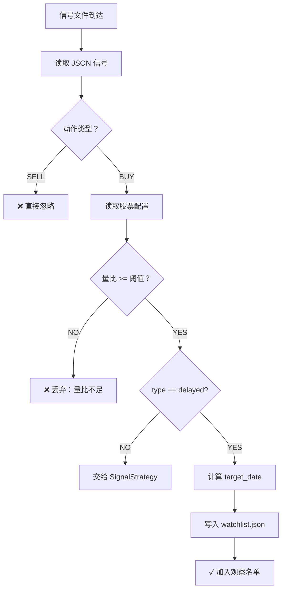
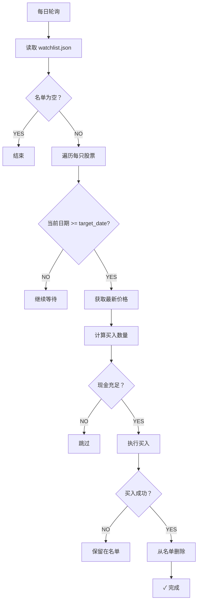

# 慢涨股延时策略 - 架构设计文档

## 一、设计哲学

### 1.1 核心理念
**"配置（规矩）与状态（记忆）分离"**

- **配置（只读）**: `stock_personalities.json` - 定义个股的交易性格，人工维护
- **状态（读写）**: `delayed_watchlist.json` - 记录正在观察的股票，系统自动维护

### 1.2 设计原则

1. **单一职责**: 每个模块只做一件事
   - `delayed_strategy.py`: 专注延时逻辑
   - `signal_strategy.py`: 专注即时信号处理
   
2. **开闭原则**: 对扩展开放，对修改封闭
   - 新增慢涨股只需修改配置文件
   - 无需改动核心代码

3. **依赖倒置**: 策略层不依赖具体实现
   - 通过接口调用 trader_engine
   - 松耦合设计

---

## 二、系统架构

### 2.1 整体架构图

```
┌─────────────────────────────────────────────────────┐
│                    AlphaPilot Pro                    │
├─────────────────────────────────────────────────────┤
│                                                      │
│  ┌──────────────┐      ┌──────────────┐            │
│  │  信号文件    │      │  QMT 行情     │            │
│  │  (输入)      │      │  (实时数据)   │            │
│  └──────┬───────┘      └──────┬───────┘            │
│         │                     │                      │
│         ▼                     ▼                      │
│  ┌──────────────────────────────────────┐          │
│  │                                      │          │
│  │       SignalStrategy                 │          │
│  │       (即时信号策略)                  │          │
│  │                                      │          │
│  └──────┬─────────────────┬─────────────┘          │
│         │                  │                        │
│         │ (分流)           │ (原逻辑)                │
│         ▼                  ▼                        │
│  ┌─────────────────┐ ┌──────────────┐             │
│  │ DelayedStrategy │ │ 普通信号处理  │             │
│  │ (延时策略)       │ │              │             │
│  └────────┬────────┘ └──────────────┘             │
│           │                                        │
│           ▼                                        │
│  ┌─────────────────────────────────────┐          │
│  │        数据持久化层                   │          │
│  ├─────────────────────────────────────┤          │
│  │ ✓ stock_personalities.json (只读)   │          │
│  │ ✓ delayed_watchlist.json (读写)     │          │
│  └────────┬────────────────────────────┘          │
│           │                                        │
│           ▼                                        │
│  ┌─────────────────────────────────────┐          │
│  │        TraderEngine                 │          │
│  │        (交易执行引擎)                │          │
│  └─────────────────────────────────────┘          │
│                                                      │
└─────────────────────────────────────────────────────┘
```

### 2.2 模块职责

#### A. DelayedStrategy（延时策略）
**职责**: 
- 接收并过滤信号（SELL 和低量比）
- 管理观察名单（写入、读取、删除）
- 计算目标日期
- 到达日期后执行买入

**依赖**:
- TraderEngine (执行交易)
- 配置文件 (获取股票性格)
- 观察名单 (持久化状态)

#### B. SignalStrategy（即时策略）
**职责**:
- 处理普通即时信号
- 在延时策略之前作为预处理器

**新增依赖**:
- DelayedStrategy (可选，用于信号分流)

#### C. TraderEngine（交易引擎）
**职责**:
- 提供统一的交易接口
- 封装 QMT SDK 细节

---

## 三、数据流设计

### 3.1 信号处理流程



### 3.2 观察名单执行流程



---

## 四、数据结构设计

### 4.1 stock_personalities.json

```json
{
    "股票代码": {
        "name": "string",           // 股票名称
        "type": "string",           // "delayed" | "immediate"
        "delay_days": "number",     // 延时天数 (仅 delayed 有效)
        "min_volume_ratio": "number" // 最小量比阈值
    },
    "default": {
        "type": "string",
        "min_volume_ratio": "number"
    }
}
```

**设计要点**:
- 使用股票代码作为键，便于快速查找
- `default` 字段提供默认配置
- 支持热更新（程序自动检测文件变更）

### 4.2 delayed_watchlist.json

```json
{
    "last_update": "datetime",      // 最后更新时间
    "watchlist": {
        "股票代码": {
            "name": "string",       // 股票名称
            "action": "BUY",        // 强制为 BUY
            "signal_date": "date",  // 信号日期
            "target_date": "date",  // 目标买入日期
            "trigger_price": "number",  // 触发价格
            "trigger_volume_ratio": "number",  // 触发量比
            "status": "string",     // "waiting"
            "delay_days": "number"  // 延时天数
        }
    }
}
```

**设计要点**:
- 外层包装 `last_update` 便于监控
- `action` 强制为 "BUY"，防止 SELL 信号污染
- 包含完整的触发信息，便于复盘分析
- 支持断点续传（持久化存储）

---

## 五、关键算法

### 5.1 目标日期计算

```python
def calculate_target_date(signal_date, delay_days):
    """
    计算目标买入日期（跳过周末）
    
    Args:
        signal_date: 信号日期 (datetime)
        delay_days: 延时天数 (int)
    
    Returns:
        target_date: 目标日期 (datetime)
    """
    target = signal_date
    remaining = delay_days
    
    while remaining > 0:
        target += timedelta(days=1)
        if target.weekday() < 5:  # 周一到周五
            remaining -= 1
    
    return target
```

**特点**:
- 自动跳过周末
- 可扩展支持节假日

### 5.2 信号过滤算法

```python
def filter_signal(code, action, volume_ratio):
    """
    三级过滤机制
    
    Returns:
        bool: True=通过，False=被过滤
    """
    # 第一级：动作过滤
    if action == "SELL":
        return False  # 严格拒绝 SELL
    
    # 第二级：量比过滤
    config = get_stock_config(code)
    min_vr = config.get('min_volume_ratio', 1.5)
    
    if volume_ratio < min_vr:
        return False  # 量比不足
    
    # 第三级：类型过滤
    stock_type = config.get('type', 'immediate')
    
    if stock_type != 'delayed':
        return False  # 不是慢涨股
    
    return True  # 通过所有过滤
```

**特点**:
- 层层递进，逐步筛选
- 短路优化（早期返回）

---

## 六、并发与同步

### 6.1 文件锁机制

虽然 Python 的 JSON 操作是原子的，但为了安全起见：

```python
def _save_watchlist(self):
    """原子写入保护"""
    temp_file = self.watchlist_file + '.tmp'
    
    # 1. 写入临时文件
    with open(temp_file, 'w') as f:
        json.dump(data, f)
    
    # 2. 原子替换
    os.remove(self.watchlist_file)
    os.rename(temp_file, self.watchlist_file)
```

**优势**:
- 防止写入中断导致数据损坏
- 避免并发读取旧数据

### 6.2 内存与文件同步

```python
# 内存中的对象
self.delayed_watchlist = {...}

# 每次修改后立即持久化
self._save_watchlist()

# 读取时重新加载
self.delayed_watchlist = self._load_watchlist()
```

**保证**:
- 重启后数据不丢失
- 多进程环境下数据一致

---

## 七、错误处理机制

### 7.1 防御性编程

```python
try:
    # 1. 检查文件存在性
    if not os.path.exists(file_path):
        log.log("文件不存在")
        return default_value
    
    # 2. 安全的 JSON 解析
    with open(file_path, 'r', encoding='utf-8') as f:
        data = json.load(f)
    
    # 3. 安全的字段访问
    value = data.get('key', default_value)
    
except Exception as e:
    log.log(f"错误：{e}")
    return default_value
```

### 7.2 降级策略

| 场景 | 降级方案 |
|------|---------|
| 配置文件不存在 | 使用 default 配置 |
| 观察名单损坏 | 初始化为空名单 |
| 日期计算失败 | 使用简单加法 |
| 买入失败 | 保留在名单，下次重试 |

---

## 八、性能优化

### 8.1 缓存策略

```python
# 配置文件缓存（带热更新检测）
def _reload_personalities_if_changed(self):
    mtime = os.path.getmtime(self.personalities_file)
    
    if mtime != self._personalities_mtime:
        # 文件已修改，重新加载
        self.stock_personalities = self._load_personalities()
        self._personalities_mtime = mtime
```

**优势**:
- 避免不必要的文件读取
- 支持热更新

### 8.2 批量操作

```python
# 集中获取行情数据
codes = list(watchlist.keys())
ticks = self.engine.get_tick_data(codes)

# 而不是逐个获取
for code in watchlist:
    tick = self.engine.get_tick_data([code])
```

**性能提升**:
- 减少网络请求次数
- 提高响应速度

---

## 九、可扩展性设计

### 9.1 支持更多股票类型

```json
{
    "603538": {
        "type": "delayed_v2",  // 新版本延时策略
        "delay_days": 3,
        "price_drop_limit": 0.05,  // 新增：跌幅限制
        "volume_confirm": true     // 新增：成交量确认
    }
}
```

**扩展点**:
- 添加新的 type 值
- 增加配置字段
- 修改 `_execute_buy()` 逻辑

### 9.2 支持分批建仓

```json
{
    "603538": {
        "type": "delayed",
        "tranches": [
            {"delay_days": 2, "ratio": 0.5},
            {"delay_days": 4, "ratio": 0.5}
        ]
    }
}
```

**实现思路**:
- 修改 watchlist 数据结构
- 支持多条目标日期
- 分批执行买入

---

## 十、测试策略

### 10.1 单元测试

```python
def test_filter_sell_signal():
    """测试 SELL 信号过滤"""
    strategy = DelayedStrategy(engine)
    result = strategy.process_signal(
        code="603538",
        action="SELL",
        price=40.0,
        volume_ratio=20.0
    )
    assert result == False
    assert strategy.watchlist.get('603538') is None

def test_low_volume_ratio_filter():
    """测试低量比过滤"""
    result = strategy.process_signal(
        code="603538",
        action="BUY",
        price=40.0,
        volume_ratio=5.0  # < 18
    )
    assert result == False

def test_delayed_buy_execution():
    """测试延时买入执行"""
    # 设置 mock 日期
    # 写入 watchlist
    # 到达目标日期
    # 验证买入订单
```

### 10.2 集成测试

```python
def test_full_workflow():
    """测试完整工作流"""
    # 1. 创建信号文件
    # 2. 启动主程序
    # 3. 等待 N 天（mock 时间）
    # 4. 验证买入成交
    # 5. 验证 watchlist 清理
```

---

## 十一、监控与日志

### 11.1 关键日志点

```python
# 1. 信号接收
log.log(f"[延时策略] {code} 通过过滤：VR={vr:.2f} >= {min_vr:.2f}")

# 2. 加入观察名单
log.log(f"[延时策略] ✓ {code} 已加入观察名单")
log.log(f"[延时策略]   信号日期：{signal_date} -> 目标日期：{target_date}")

# 3. 每日轮询
log.log(f"[延时策略] >>> 开始检查观察名单 ({count}只)")

# 4. 到达执行日
log.log(f"[延时策略] ★ {code} 到达目标日期！")

# 5. 执行结果
log.log(f"[延时策略] {'✓✓✓' if success else '✗'} {code}")
```

### 11.2 监控指标

| 指标 | 含义 | 告警阈值 |
|------|------|---------|
| watchlist_size | 观察名单大小 | >50 |
| avg_wait_days | 平均等待天数 | >5 |
| success_rate | 买入成功率 | <90% |
| false_positive_rate | 误判率 | >20% |

---

## 十二、部署与维护

### 12.1 部署步骤

1. **复制文件**:
   ```bash
   cp strategies/delayed_strategy.py <project_dir>/strategies/
   cp data/stock_personalities.json <project_dir>/data/
   ```

2. **修改配置**:
   - 编辑 `main.py` 导入和初始化
   - 编辑 `settings.py` 添加参数

3. **初始化数据目录**:
   ```bash
   mkdir -p data
   echo '{"last_update":"","watchlist":{}}' > data/delayed_watchlist.json
   ```

4. **启动测试**:
   ```bash
   python main.py
   ```

### 12.2 日常维护

**每周**:
- 检查观察名单执行情况
- 调整表现不佳的股票参数

**每月**:
- 回测历史数据
- 优化配置参数
- 清理无效配置

---

## 十三、总结

### 架构优势

✅ **清晰的职责划分**: 配置 vs 状态，延时 vs 即时  
✅ **高内聚低耦合**: 模块独立，接口清晰  
✅ **易于扩展**: 新增股票类型无需改代码  
✅ **健壮性强**: 完善的错误处理和降级机制  
✅ **可维护性好**: 详细日志，支持热更新  

### 技术亮点

🔧 **配置与状态分离** - 只读配置 + 读写状态  
🔧 **断点续传** - 持久化观察名单  
🔧 **热更新** - 配置文件实时生效  
🔧 **原子写入** - 数据安全保护  
🔧 **智能过滤** - 三级过滤机制  

### 业务价值

💰 **捕捉慢涨机会** - 不再错过美诺华式股票  
💰 **过滤无效信号** - 提高信号质量  
💰 **智能延时** - 自动等待最佳买点  
💰 **人机协作** - 人工经验 + 系统执行  

---

*架构版本：v1.0*  
*设计日期：2026-04-04*  
*设计师：资深量化架构师*
